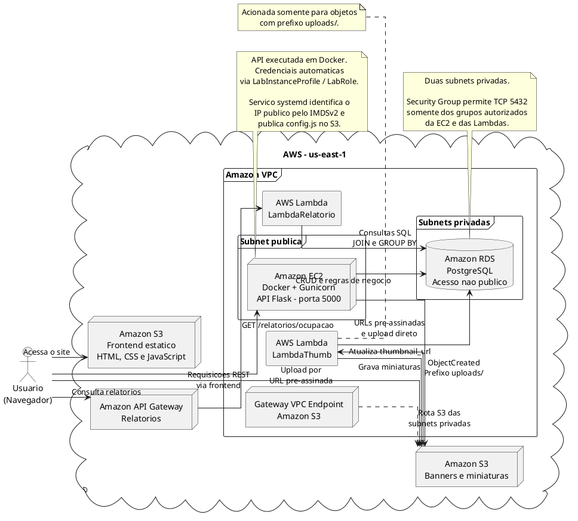

# Design e Arquitetura do Sistema (Design)

## 1. Diagrama de Arquitetura

```plantuml

@startuml
left to right direction
skinparam componentStyle rectangle
skinparam linetype ortho
skinparam shadowing false
skinparam defaultTextAlignment center
skinparam packageStyle rectangle

actor "Usuario\n(Navegador)" as Usuario

cloud "AWS - us-east-1" {

    node "Amazon S3\nFrontend estatico\nHTML, CSS e JavaScript" as Frontend

    node "Amazon S3\nBanners e miniaturas" as Banners

    node "Amazon API Gateway\nRelatorios" as Gateway

    frame "Amazon VPC" {

        frame "Subnet publica" {
            node "Amazon EC2\nDocker + Gunicorn\nAPI Flask - porta 5000" as EC2
        }

        frame "Subnets privadas" {
            database "Amazon RDS\nPostgreSQL\nAcesso nao publico" as RDS
        }

        component "AWS Lambda\nLambdaThumb" as Thumb

        component "AWS Lambda\nLambdaRelatorio" as Relatorio

        node "Gateway VPC Endpoint\nAmazon S3" as Endpoint
    }
}

Usuario --> Frontend : Acessa o site
Usuario --> EC2 : Requisicoes REST\nvia frontend
Usuario --> Gateway : Consulta relatorios
Usuario --> Banners : Upload por\nURL pre-assinada

EC2 --> RDS : CRUD e regras de negocio
EC2 --> Banners : URLs pre-assinadas\ne upload direto

Gateway --> Relatorio : GET /relatorios/ocupacao
Relatorio --> RDS : Consultas SQL\nJOIN e GROUP BY

Banners --> Thumb : ObjectCreated\nPrefixo uploads/
Thumb --> Banners : Grava miniaturas
Thumb --> RDS : Atualiza thumbnail_url

Endpoint ..> Banners : Rota S3 das\nsubnets privadas

note bottom of EC2
API executada em Docker.
Credenciais automaticas
via LabInstanceProfile / LabRole.

Servico systemd identifica o
IP publico pelo IMDSv2 e
publica config.js no S3.
end note

note bottom of RDS
Duas subnets privadas.

Security Group permite TCP 5432
somente dos grupos autorizados
da EC2 e das Lambdas.
end note

note bottom of Thumb
Acionada somente para objetos
com prefixo uploads/.
end note

@enduml
```
